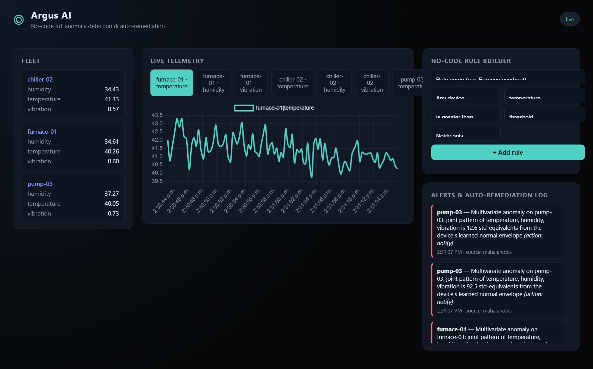
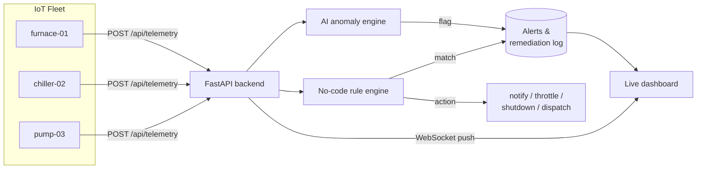
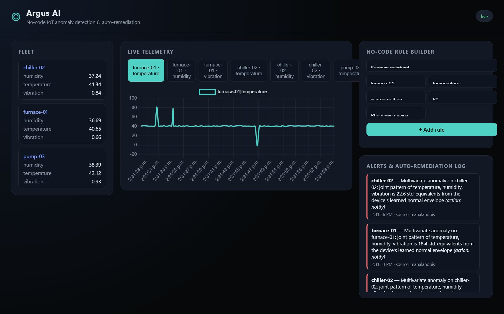

# Argus AI

**Give your IoT fleet a thousand eyes.**

Argus AI is a no-code IoT anomaly detection and auto-remediation platform. Point it at any device telemetry stream, and it learns what "normal" looks like per device — no training data, no ML expertise, no config files — then flags the moment something drifts, and lets anyone on the team wire up an automatic response through a plain web form, not a Python script.

Built for the **DevNetwork API/Cloud/AI Hackathon 2026** — spanning the IoT, Low/No-Code, and Machine Learning/AI tracks.



## The problem

Industrial and IoT teams drown in sensor dashboards but starve for *action*. Setting a static threshold ("alert if temp > 80°C") misses slow degradation and multi-sensor faults; building a real anomaly-detection pipeline usually means a data scientist, a training dataset, and a deploy pipeline most small teams don't have. And even after an anomaly is found, turning that signal into an automatic response (throttle it, shut it down, page someone) still means writing and shipping code.

Argus AI collapses that whole chain into one running service: **stream in → AI flags the anomaly → no-code rule decides what to do about it → action is logged.**

## How it works



### AI anomaly detection — zero heavy dependencies, by design

Argus ships **two streaming detectors that fit online**, with no training step, no model file, and — deliberately — no numpy/scipy/scikit-learn:

1. **EWMA z-score** on each individual metric: an exponentially-weighted moving average and variance track each sensor's own baseline in real time; a reading more than 3σ away is flagged instantly.
2. **Online Mahalanobis distance** across each device's full metric set (temperature + humidity + vibration, etc.), using an incrementally-updated EWMA mean vector and covariance matrix. This catches the anomalies a single threshold can't — e.g. temperature and vibration drifting together in a way that's individually within range but jointly abnormal.

Both are implemented in pure Python (`backend/app/anomaly.py`). That's not a limitation, it's the point: it means Argus has no compiled wheels to fail to install on a given OS/Python combo, and it keeps a serverless deployment's cold start fast, since there's no multi-hundred-MB ML dependency tree to load per invocation.

### No-code rule builder

Anyone — not just whoever wrote the backend — can define response logic from the dashboard: *"if `pump-03` `vibration` is greater than `2.4`, dispatch a technician."* No YAML, no redeploy. Rules are evaluated against every incoming reading alongside the AI detector, and both feed the same alert log with the action that was taken.



### Cloud-ready

- `backend/Dockerfile` + `docker-compose.yml` — run the whole stack in one container.
- `backend/lambda_handler.py` — the same FastAPI app, wrapped with [Mangum](https://github.com/jordaneremieff/mangum) for AWS Lambda + API Gateway, so it scales to zero and back with no server to patch.

## Tech stack

| Layer | Choice |
|---|---|
| Backend API | FastAPI + Uvicorn (Python) |
| Realtime push | WebSocket (native FastAPI) |
| AI / anomaly detection | Pure-Python EWMA z-score + online Mahalanobis distance |
| Storage | SQLite (zero-ops, swap for Postgres/RDS in production) |
| Frontend | Vanilla JS + Chart.js — no build step |
| IoT simulator | Python + httpx, synthetic multi-device sensor fleet |
| Cloud deploy | Docker, AWS Lambda (Mangum) |

## Quickstart

```bash
# 1. Backend
cd backend
python -m venv .venv
.venv/Scripts/activate   # Windows: .venv\Scripts\activate | macOS/Linux: source .venv/bin/activate
pip install -r requirements.txt
uvicorn app.main:app --reload

# 2. Dashboard
# open http://localhost:8000 — it's served by the backend, nothing else to run

# 3. Feed it a simulated IoT fleet (separate terminal)
cd simulator
pip install -r requirements.txt
python simulate.py --backend http://localhost:8000 --devices 4
```

Then, from the dashboard, add a rule (e.g. `temperature greater than 60 → Shutdown device`) and watch the simulator's injected spikes trigger both the AI detector and your rule in the live alert feed.

### Docker

```bash
docker compose up --build
# dashboard at http://localhost:8000
```

### Deploying to AWS Lambda

`backend/lambda_handler.py` exposes `handler`, ready to hand to API Gateway (HTTP API) via your IaC tool of choice (SAM, CDK, Serverless Framework, Zappa). SQLite storage is fine for a demo; swap `backend/app/db.py` for an RDS/DynamoDB-backed implementation for a production, multi-instance deployment.

## Project structure

```
argus-ai/
├── backend/
│   ├── app/
│   │   ├── main.py        # FastAPI routes, WebSocket, static hosting
│   │   ├── anomaly.py      # AI anomaly engine (EWMA + Mahalanobis)
│   │   ├── db.py            # SQLite persistence
│   │   └── models.py        # Pydantic request/response schemas
│   ├── lambda_handler.py    # AWS Lambda entrypoint (Mangum)
│   ├── Dockerfile
│   └── requirements.txt
├── frontend/                # Vanilla JS dashboard (Chart.js via CDN)
├── simulator/                # Synthetic IoT fleet generator
└── docker-compose.yml
```

## Why this fits the hackathon tracks

- **IoT** — the whole system is built around a live, multi-device sensor fleet (real or simulated) and the operational loop of detect → decide → act.
- **Low/No-Code** — the rule builder is the primary way a non-developer configures automated responses; no code or redeploy required.
- **Machine Learning / AI** — real streaming anomaly detection (EWMA + online Mahalanobis distance), not a hardcoded threshold, running without any external AI API or GPU.
- **API/Cloud** — a clean REST + WebSocket API, containerized, with a serverless deployment path included out of the box.

## Roadmap

- Pluggable notification channels (email/SMS/Slack) for the `notify` action
- Per-metric confidence scores surfaced in the dashboard, not just a binary flag
- Swap SQLite for a managed database and deploy the reference Lambda stack
- Auth + multi-tenant fleets

## License

MIT — see [LICENSE](LICENSE).
